# TP1_Fatima Zahrae_TAKKAL 

**Réalisé par : Fatima Zahrae TAKKAL**  
**Numéro d'inscription : SMI0036/23**    

---

##  Description du TP
Ce TP consiste à préparer le **TP1** et à le soumettre via un dépôt **GitHub**.  
L'objectif est de :  
- Créer un dépôt nommé `TP1_FatimaZahrae_TAKKAL`  
- Travailler sur une branche `dev` avec plusieurs commits  
- Merger `dev` dans `main` via une **Pull Request**  
- Préparer un **README.md** clair et complet  
- Ajouter des captures d'écran illustrant le TP

---

##  Branches
| Branche | Description                                  |
|---------|----------------------------------------------|
| `main`  | Branche principale après Merge               |
| `dev`   | Branche de développement avec tous lecommits |

---

## 🗂️ Contenu du dépôt
- Fichiers du TP1 (`.java`, `.txt`, etc.)  
- `README.md`  
- Captures d'écran dans le dossier `screenshots/`  

---

## 🖼️ Captures d'écran

###  TP1 
  ## Création et initialisation de votre premier dépôt
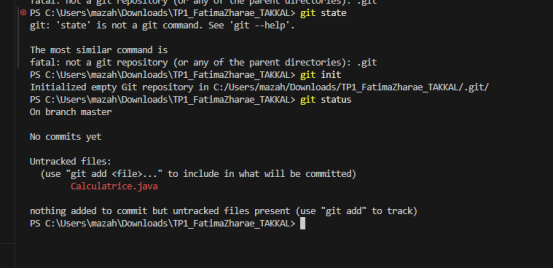
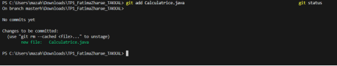

## 3.Suivre un fichier
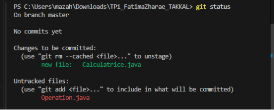

##  4.Passer votre premier commit
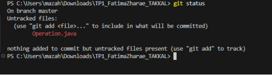
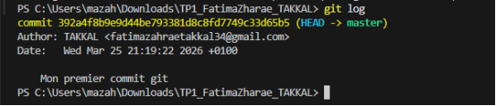
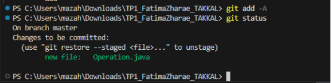
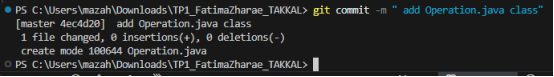
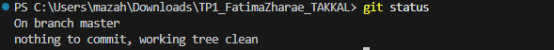
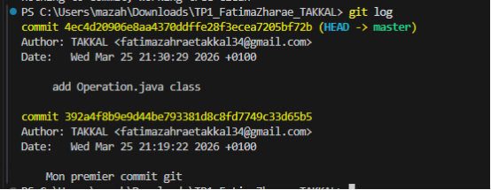
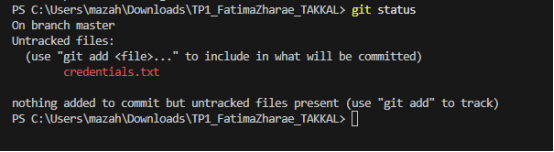
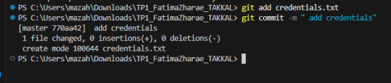
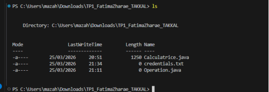
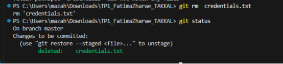

## 5.Ignorer un fichier
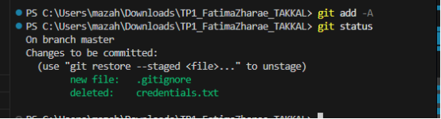
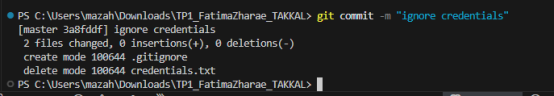
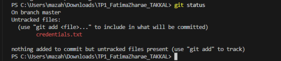

## Pousser votre code vers un dépôt distant
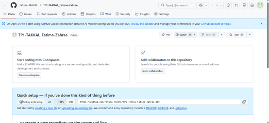
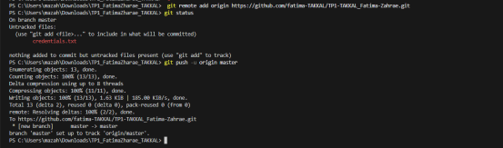
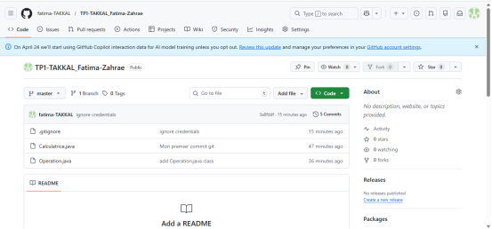
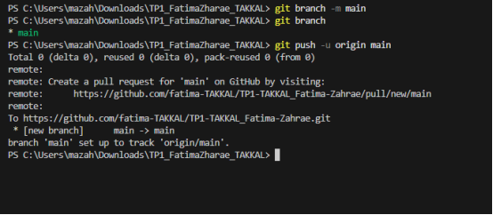
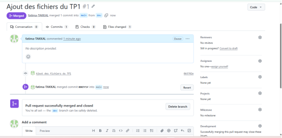
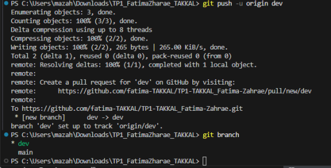

## Création de la branche dev
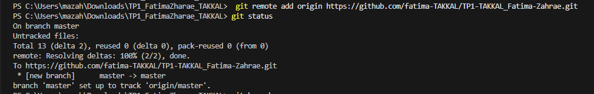

## Commits 
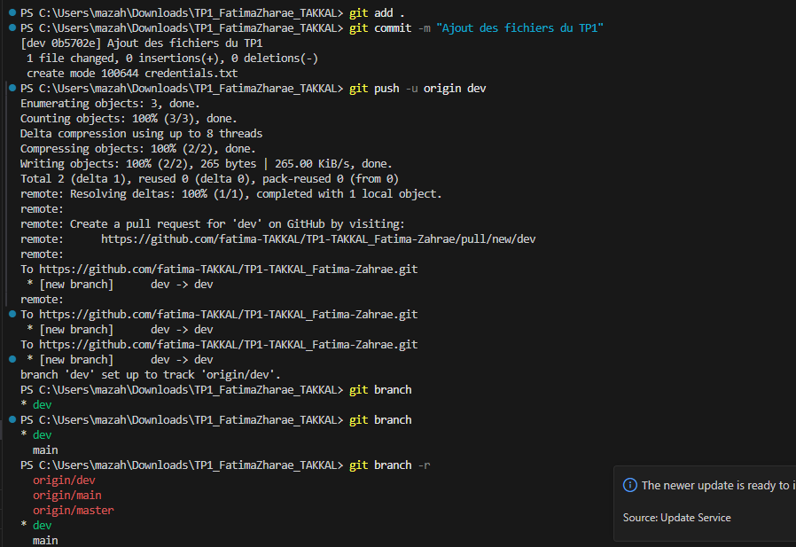

## push
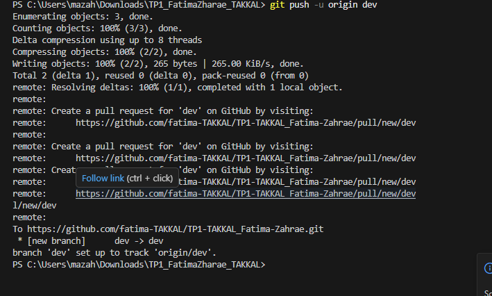

## Pull Request et Merge
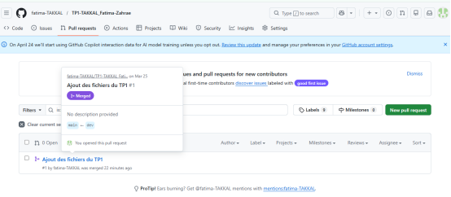

